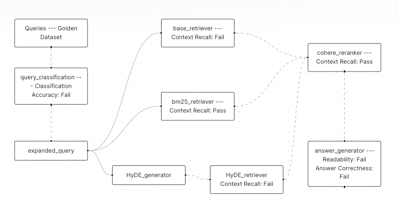
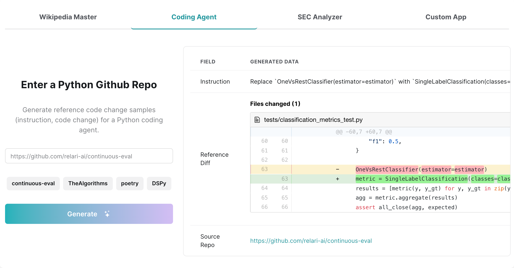

<h3 align="center">
  
</h3>

<div align="center">

  
  <a href="https://docs.relari.ai/" target="_blank"></a>
  <a href="https://pypi.python.org/pypi/continuous-eval"></a>
  <a href="https://github.com/relari-ai/continuous-eval/releases"></a>
  <a href="https://pypi.python.org/pypi/continuous-eval/"></a>
  <a a href="https://github.com/relari-ai/continuous-eval/blob/main/LICENSE"></a>


</div>

<h2 align="center">
  <p>Open-Source Evaluation for GenAI Applications</p>
</h2>


## Overview

`continuous-eval` is an open-source package created for granular and holistic evaluation of GenAI application pipelines. 

<h1 align="center">
  
</h1>

## How is continuous-eval different?

- **Modularized Evaluation**: Measure each module in the pipeline with tailored metrics.

- **Comprehensive Metric Library**: Covers Retrieval-Augmented Generation (RAG), Code Generation, Agent Tool Use, Classification and a variety of other LLM use cases. Mix and match Deterministic, Semantic and LLM-based metrics.

- **Leverage User Feedback in Evaluation**: Easily build a close-to-human ensemble evaluation pipeline with mathematical guarantees.

- **Synthetic Dataset Generation**: Generate large-scale synthetic dataset to test your pipeline.

## Getting Started

This code is provided as a PyPi package. To install it, run the following command:

```bash
python3 -m pip install continuous-eval
```

if you want to install from source:

```bash
git clone https://github.com/relari-ai/continuous-eval.git && cd continuous-eval
poetry install --all-extras
```

To run LLM-based metrics, the code requires at least one of the LLM API keys in `.env`. Take a look at the example env file `.env.example`.

## Run a single metric

Here's how you run a single metric on a datum.
Check all available metrics here: [link](https://docs.relari.ai/)

```python
from continuous_eval.metrics.retrieval import PrecisionRecallF1

datum = {
    "question": "What is the capital of France?",
    "retrieved_context": [
        "Paris is the capital of France and its largest city.",
        "Lyon is a major city in France.",
    ],
    "ground_truth_context": ["Paris is the capital of France."],
    "answer": "Paris",
    "ground_truths": ["Paris"],
}

metric = PrecisionRecallF1()

print(metric(**datum))
```

### Available Metrics

<table border="0">
    <tr>
        <th>Module</th>
        <th>Category</th>
        <th>Metrics</th>
    </tr>
    <tr>
        <td rowspan="2">Retrieval</td>
        <td>Deterministic</td>
        <td>PrecisionRecallF1, RankedRetrievalMetrics</td>
    </tr>
    <tr>
        <td>LLM-based</td>
        <td>LLMBasedContextPrecision, LLMBasedContextCoverage</td>
    </tr>
    <tr>
        <td rowspan="3">Text Generation</td>
        <td>Deterministic</td>
        <td>DeterministicAnswerCorrectness, DeterministicFaithfulness, FleschKincaidReadability</td>
    </tr>
    <tr>
        <td>Semantic</td>
        <td>DebertaAnswerScores, BertAnswerRelevance, BertAnswerSimilarity</td>
    </tr>
    <tr>
        <td>LLM-based</td>
        <td>LLMBasedFaithfulness, LLMBasedAnswerCorrectness, LLMBasedAnswerRelevance, LLMBasedStyleConsistency</td>
    </tr>
    <tr>
        <td rowspan="1">Classification</td>
        <td>Deterministic</td>
        <td>ClassificationAccuracy</td>
    </tr>
    <tr>
        <td rowspan="2">Code Generation</td>
        <td>Deterministic</td>
        <td>CodeStringMatch, PythonASTSimilarity</td>
    </tr>
    <tr>
        <td>LLM-based</td>
        <td>LLMBasedCodeGeneration</td>
    </tr>
    <tr>
        <td>Agent Tools</td>
        <td>Deterministic</td>
        <td>ToolSelectionAccuracy</td>
    </tr>
    <tr>
        <td>Custom</td>
        <td></td>
        <td>Define your own metrics</td>
    </tr>
</table>

To define your own metrics, you only need to extend the [Metric](continuous_eval/metrics/base.py#L23C7-L23C13) class implementing the `__call__` method.
Optional methods are `batch` (if it is possible to implement optimizations for batch processing) and `aggregate` (to aggregate metrics results over multiple samples_).

## Run evaluation on a pipeline

Define modules in your pipeline and select corresponding metrics.

```python
from continuous_eval.eval import Module, ModuleOutput, Pipeline, Dataset, EvaluationRunner
from continuous_eval.eval.logger import PipelineLogger
from continuous_eval.metrics.retrieval import PrecisionRecallF1, RankedRetrievalMetrics
from continuous_eval.metrics.generation.text import DeterministicAnswerCorrectness
from typing import List, Dict

dataset = Dataset("dataset_folder")

# Simple 3-step RAG pipeline with Retriever->Reranker->Generation
retriever = Module(
    name="Retriever",
    input=dataset.question,
    output=List[str],
    eval=[
        PrecisionRecallF1().use(
            retrieved_context=ModuleOutput(),
            ground_truth_context=dataset.ground_truth_context,
        ),
    ],
)

reranker = Module(
    name="reranker",
    input=retriever,
    output=List[Dict[str, str]],
    eval=[
        RankedRetrievalMetrics().use(
            retrieved_context=ModuleOutput(),
            ground_truth_context=dataset.ground_truth_context,
        ),
    ],
)

llm = Module(
    name="answer_generator",
    input=reranker,
    output=str,
    eval=[
        FleschKincaidReadability().use(answer=ModuleOutput()),
        DeterministicAnswerCorrectness().use(
            answer=ModuleOutput(), ground_truth_answers=dataset.ground_truths
        ),
    ],
)

pipeline = Pipeline([retriever, reranker, llm], dataset=dataset)
print(pipeline.graph_repr()) # optional: visualize the pipeline
```

Now you can run the evaluation on your pipeline

```python
pipelog = PipelineLogger(pipeline=pipeline)

# now run your LLM application pipeline, and for each module, log the results:
pipelog.log(uid=sample_uid, module="module_name", value=data)

# Once you finish logging the data, you can use the EvaluationRunner to evaluate the logs
evalrunner = EvaluationRunner(pipeline)
metrics = evalrunner.evaluate(pipelog)
metrics.results() # returns a dictionary with the results
```

To run evaluation over an existing dataset (BYODataset), you can run the following:

```python
dataset = Dataset(...)
evalrunner = EvaluationRunner(pipeline)
metrics = evalrunner.evaluate(dataset)
```

## Synthetic Data Generation

Ground truth data, or reference data, is important for evaluation as it can offer a comprehensive and consistent measurement of system performance. However, it is often costly and time-consuming to manually curate such a golden dataset.
We have created a synthetic data pipeline that can custom generate user interaction data for a variety of use cases such as RAG, agents, copilots. They can serve a starting point for a golden dataset for evaluation or for other training purposes. Below is an example for Coding Agents. Try out this demo: [Synthetic Data Demo](https://www.relari.ai/synthetic-data-demo)

<h1 align="center">
  
</h1>

## 💡 Contributing

Interested in contributing? Contributions to LlamaIndex core as well as contributing
integrations that build on the core are both accepted and highly encouraged! See our [Contribution Guide](CONTRIBUTING.md) for more details.

## Resources

- **Docs:** [link](https://docs.relari.ai/)
- **Examples Repo**: [end-to-end example repo](https://github.com/relari-ai/examples)
- **Blog Posts:**
  - Practical Guide to RAG Pipeline Evaluation: [Part 1: Retrieval](https://medium.com/relari/a-practical-guide-to-rag-pipeline-evaluation-part-1-27a472b09893), [Part 2: Generation](https://medium.com/relari/a-practical-guide-to-rag-evaluation-part-2-generation-c79b1bde0f5d)
  - How important is a Golden Dataset for LLM evaluation?
 [(link)](https://medium.com/relari/how-important-is-a-golden-dataset-for-llm-pipeline-evaluation-4ef6deb14dc5)
  - How to evaluate complex GenAI Apps: a granular approach [(link)](https://medium.com/relari/how-to-evaluate-complex-genai-apps-a-granular-approach-0ab929d5b3e2)
  - How to Make the Most Out of LLM Production Data: Simulated User Feedback [(link)](https://medium.com/towards-data-science/how-to-make-the-most-out-of-llm-production-data-simulated-user-feedback-843c444febc7)
  - Generate Synthetic Data to Test LLM Applications [(link)](https://medium.com/relari/generate-synthetic-data-to-test-llm-applications-4bffeb51b80e)
- **Discord:** Join our community of LLM developers [Discord](https://discord.gg/GJnM8SRsHr)
- **Reach out to founders:** [Email](mailto:founders@relari.ai) or [Schedule a chat](https://cal.com/pasquale/continuous-eval)

## License

This project is licensed under the Apache 2.0 - see the [LICENSE](LICENSE) file for details.

## Open Analytics

We monitor basic anonymous usage statistics to understand our users' preferences, inform new features, and identify areas that might need improvement.
You can take a look at exactly what we track in the [telemetry code](continuous_eval/utils/telemetry.py)

To disable usage-tracking you set the `CONTINUOUS_EVAL_DO_NOT_TRACK` flag to `true`.
